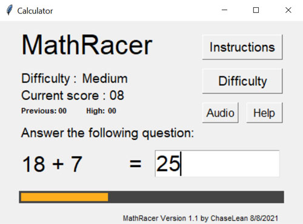

# TypeRacer

TypeRacer is a simple math game using the Tkinter GUI. This is my first personal project written in Python. 

## Table of contents
* [General info](#general-info)
* [Setup](#setup)

## General info
The program will show a simple math equation on screen, and the user has to key in their answer. 



Meanwhile, the health bar constantly decreases. A correct answer gains some health, while a wrong answer deducts some health. 

There are 3 levels of difficulty: Easy, Medium and Hard. 
	
## Setup
Clone or download the repository.

```
git clone https://github.com/ChaseLean/typeracer
```
